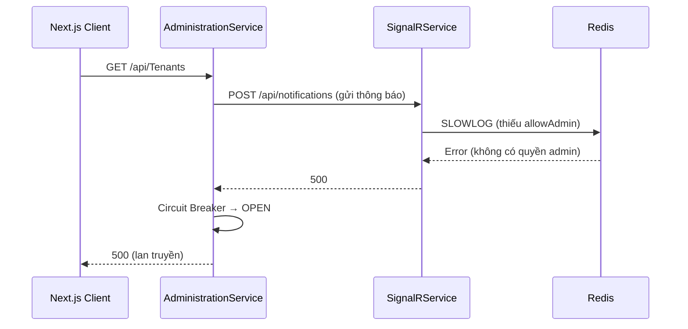

# [fix_bug] SignalR Circuit Breaker — 500 Internal Server Error

> **Notion:** *(resolved — không tạo Notion riêng)*
> **Ngày tạo:** 2026-03-22
> **Cập nhật lần cuối:** 2026-03-25
> **Status:** done
> **Module:** AdministrationService / SignalRService

---

## 📋 Mô tả

Next.js trả về 500 khi gọi API qua Proxy. Nguyên nhân: `AdministrationService` không kết nối được `SignalRService` → Circuit Breaker chuyển sang trạng thái OPEN → tất cả request trong Admin Service đều fail theo.

**Root causes (3 tầng):**
1. `SignalRService` thiếu đăng ký kiểu dữ liệu JSON Source Gen → trả 500
2. Redis thiếu `allowAdmin=true` → `SLOWLOG` command fail → Dashboard 500
3. IP `172.23.48.1` chưa có trong `allowedOrigins` Next.js config

## 🎯 Mục tiêu & Actor

- **Actor:** System (runtime error)
- **Mục tiêu:** Khôi phục kết nối Admin → SignalR, reset Circuit Breaker, ngăn lỗi lan truyền sang API khác

## 🔀 Flow (Error Propagation)

## 📐 Scope ảnh hưởng

- [x] Model / DB: N/A
- [x] API endpoint: N/A
- [x] Permission: N/A
- [x] Frontend: `next.config.ts` — thêm allowed origins
- [x] Background job: N/A
- [x] SignalR: `AppJsonContext.cs`, Redis connection string `allowAdmin=true`

## ✅ Checklist

### SignalRService
- [x] Thêm `[JsonSerializable]` cho `NotificationRequest` và `JobStatusRequest` vào `AppJsonContext.cs`
- [x] Bật `allowAdmin=true` trong Redis connection string
- [x] Rebuild: `docker-compose up -d --build signalr`

### AdministrationService
- [x] Restart để reset Circuit Breaker: `docker-compose restart admin-service`

### Frontend
- [x] Thêm `172.23.48.1:3001` vào `allowedOrigins` trong `next.config.ts`

## ⚠️ Rủi ro / Lưu ý

- Port SignalRService phải nhất quán: Dockerfile `10000`, docker-compose `10000`, AdminService config `http://signalr:10000`
- Circuit Breaker chỉ reset sau khi restart container hoặc hết `samplingDuration`

## 📝 Ghi chú hoàn thành

Fixed 2026-03-22. Xem thêm: [bug-tenant-migration-notification.spec.md](./bug-tenant-migration-notification.spec.md) cho SignalR port consistency fix.
