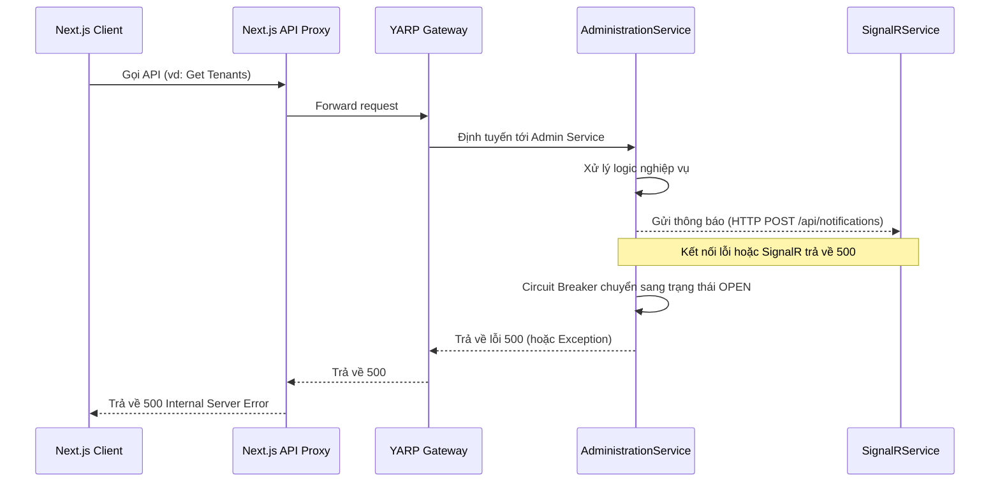

# Bug Analysis: 500 Internal Server Error in Next.js (SignalR Circuit Breaker)

## 1. Tóm tắt vấn đề (Summary)
Ứng dụng Next.js nhận phản hồi HTTP 500 khi thực hiện các yêu cầu API thông qua Proxy. Qua kiểm tra logs, xác định nguyên nhân do `AdministrationService` không thể kết nối tới `SignalRService`, dẫn đến trạng thái **Circuit Breaker OPEN**.

- **Symptom:** Next.js UI hiển thị lỗi 500, console log báo "Failed to load resource".
- **Impact:** Các chức năng cần cập nhật trạng thái thời gian thực (như Migration, Notifications) bị gián đoạn và gây lỗi lan truyền sang các API khác trong `AdministrationService`.

## 2. Phân tích nguyên nhân (Root Cause Analysis)

### Sơ đồ luồng lỗi (Error Flow)

### Bằng chứng từ Logs (Evidence)
- **AdministrationService Logs:**
  `[15:59:21 WRN] Circuit Breaker is OPEN for SignalRService. Skipping calls.`
- **SignalRService Logs (Root Cause):**
  1. `System.NotSupportedException: JsonTypeInfo metadata for type 'SignalRService.Controllers.JobStatusRequest' was not provided by TypeInfoResolver` (Đã fix)
  2. `StackExchange.Redis.RedisCommandException: This operation is not available unless admin mode is enabled: SLOWLOG` (Phát hiện mới)

### Nguyên nhân gốc rễ (Root Cause)
1. Thiếu đăng ký kiểu dữ liệu cho JSON Source Gen trong `SignalRService`.
2. `SignalRService` gọi lệnh `SLOWLOG` tới Redis nhưng chuỗi kết nối thiếu quyền `allowAdmin=true`. Dashboard của Next.js gọi API `redis-slowlog` bị lỗi 500, dẫn đến toàn bộ trang Dashboard hiển thị lỗi "Connection Lost".
3. Địa chỉ IP của người dùng (`172.23.48.1`) chưa có trong `allowedOrigins` của Next.js config, có thể gây lỗi Server Actions.

## 3. Checklist Thực hiện (Checklist)
- [x] Đăng ký `NotificationRequest` và `JobStatusRequest` vào `AppJsonContext.cs`.
- [x] Bật `allowAdmin=true` trong chuỗi kết nối Redis của `SignalRService`.
- [x] Thêm `172.23.48.1:3001` vào `next.config.ts`.
- [x] Rebuild và restart `erp-signalr`.
- [x] Restart `erp-admin-service` để reset trạng thái Circuit Breaker.
- [ ] Xác nhận UI Next.js hoạt động bình thường.

## 4. Giải pháp đã thực hiện (Implemented Solution)
1. Thêm attribute `[JsonSerializable]` cho các class request trong `SignalRService/Infrastructure/AppJsonContext.cs`.
2. Chạy lệnh rebuild: `docker-compose up -d --build signalr admin-service`.

---
**Tôi đã hoàn thành bước phân tích lỗi. Bạn có muốn tôi tiến hành kiểm tra sâu hơn vào log của SignalRService để tìm nguyên nhân gốc rễ không?**
