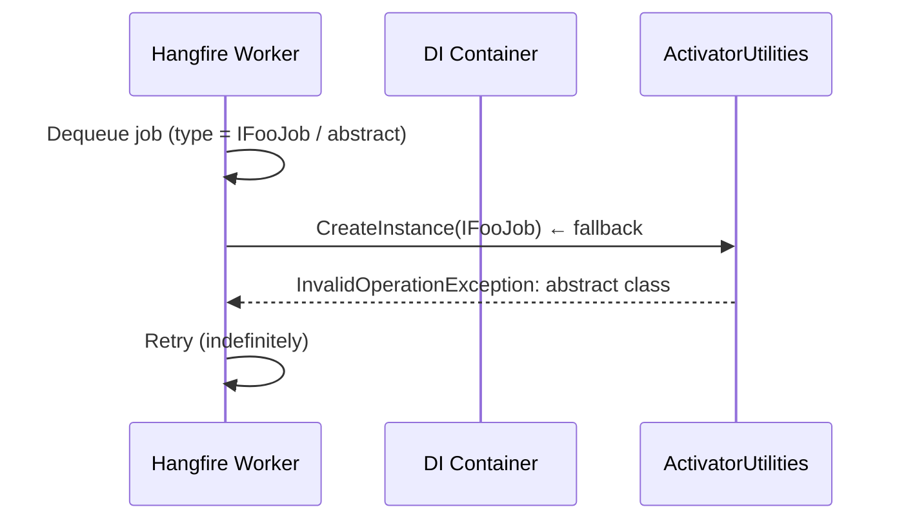

# [fix_bug] Hangfire Abstract/Interface Job Activation

> **Notion:** *(chưa tạo — bug nhỏ, resolve nhanh)*
> **Ngày tạo:** 2026-03-15
> **Cập nhật lần cuối:** 2026-03-25
> **Status:** done
> **Module:** AdministrationService

---

## 📋 Mô tả

Hangfire worker throw `Instances of abstract classes cannot be created` khi cố khởi tạo job được enqueue bằng interface type (`IFooJob`) thay vì concrete class. Job retry liên tục và không bao giờ chạy thành công.

## 🎯 Mục tiêu & Actor

- **Actor:** System (Hangfire worker)
- **Mục tiêu:** Cho phép Hangfire resolve job qua DI container (hỗ trợ interface) thay vì `ActivatorUtilities.CreateInstance` thuần túy

## 🔀 Flow (Root Cause)

**Nguyên nhân:** `RecurringJob.AddOrUpdate<IFooJob>(...)` lưu interface type vào storage. Khi execute, `AspNetCoreJobActivatorScope` fallback `ActivatorUtilities` → throw vì không tạo được interface instance.

## 📐 Scope ảnh hưởng

- [x] Model / DB: N/A
- [x] API endpoint: N/A
- [x] Permission: N/A
- [x] Frontend: N/A
- [x] Background job: `DiFirstJobActivator` trong `Program.cs`, DI mapping `ITenantMigrationJob → TenantMigrationJob`

## ✅ Checklist

### Backend
- [x] Implement `DiFirstJobActivator` — resolve từ DI trước, fallback `ActivatorUtilities` chỉ với concrete type
- [x] Đăng ký `services.AddScoped<ITenantMigrationJob, TenantMigrationJob>()` trong `DependencyInjection.cs`
- [x] Verify Hangfire dashboard không còn fail với lỗi abstract class

## ⚠️ Rủi ro / Lưu ý

- Nếu storage còn job cũ enqueue bằng interface type khác → cần đăng ký DI mapping hoặc xóa/requeue qua Hangfire dashboard
- Verify command: `dotnet build .\AdministrationService\AdministrationService.csproj -c Release`

## 📝 Ghi chú hoàn thành

Fixed 2026-03-15. Files sửa: `Program.cs:114` (DiFirstJobActivator), `Extensions/DependencyInjection.cs:18`.
