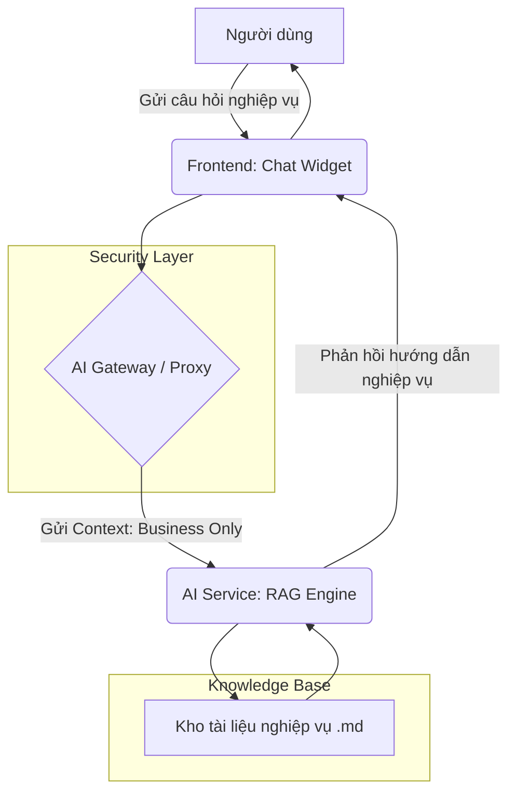

# Specification: Business AI Notebook

## 1. Mô tả
Trợ lý trí tuệ nhân tạo (hệ thống AI RAG) phục vụ người dùng cuối trong việc tìm hiểu quy trình nghiệp vụ, hướng dẫn sử dụng hệ thống và tra cứu chính sách công ty mà không cần sự hỗ trợ của kỹ thuật.

### Nguyên tắc bảo mật:
- **Business-Only**: AI chỉ được phép truy cập và trả lời dựa trên kho dữ liệu nghiệp vụ (Business Knowledge Base).
- **No-Tech-Leak**: Tuyệt đối không tiết lộ thông tin về: Cấu trúc cơ sở dữ liệu, Endpoint API, Code Logic Backend, hay Kiến trúc hệ thống.

## 2. Luồng hoạt động (User Flow)

### Sơ đồ ASCII (Tổng quan):
```text
+----------------+       +-------------------+       +-----------------------+
|   End User     |       |  Frontend (Web)   |       |   AI Gateway/Proxy    |
| (Action: Chat) | <---> | (Notebook Widget) | <---> | (Security & Auth)     |
+----------------+       +-------------------+       +-----------+-----------+
                                                                 |
                                              +------------------v----------+
                                              |       AI RAG Engine         |
                                              | (System: Business-Only)     |
                                              +------------------+----------+
                                                                 |
                                              +------------------v----------+
                                              |  Business Knowledge Base    |
                                              | (.md files, Policies, User-Guides) |
                                              +-----------------------------+
```

### Sơ đồ Mermaid (Chi tiết):


## 3. Các thành phần chính

### 3.1. Hybrid Tech Stack (Công nghệ đề xuất)
- **AI Core Backend**: **Python (FastAPI)** - Ngôn ngữ tối ưu nhất cho AI/ML workloads.
- **Orchestration**: **LangChain** hoặc **LlamaIndex** - Quản lý luồng RAG (Retrieval-Augmented Generation).
- **Vector Database**: **Qdrant** hoặc **ChromaDB** - Lưu trữ và tìm kiếm vector ngữ nghĩa, hỗ trợ phân tách dữ liệu theo Tenant.
- **LLM API**: **Google Gemini 1.5 Pro** hoặc **GPT-4o** - Xử lý suy luận và trả lời câu hỏi.
- **Frontend Integration**: **Next.js API Routes** đóng vai trò Proxy/Orchestrator kết nối với Python AI Service.

### 3.2. Knowledge Base (Kho tri thức)
- Vị trí: `.agent/specs/ai/knowledge/business/` (Local MD files).
- Định dạng: Các file `.md` mô tả quy trình nghiệp vụ (Sales, Inventory, HR, v.v.).

### 3.3. AI Engine (RAG)
- **Embedding**: Chuyển đổi văn bản nghiệp vụ thành vector số học.
- **System Prompt**: *"Bạn là chuyên gia nghiệp vụ ERP. Bạn chỉ trả lời các câu hỏi về quy trình kinh doanh và hướng dẫn sử dụng. Nếu người dùng hỏi về kỹ thuật, database hoặc code, hãy lịch sự từ chối và hướng dẫn họ tập trung vào nghiệp vụ."*

### 3.4. Frontend UI
- Một Sidebar hoặc một trang riêng biệt mang phong cách "Notebook".
- Hỗ trợ Markdown rendering trong khung chat.

## 4. Danh sách nhiệm vụ (Checklist)

### Giai đoạn 1: Cơ sở hạ tầng tri thức (COMPLETED)
- [x] Tạo cấu trúc thư mục chứa tài liệu nghiệp vụ mẫu.
- [x] Viết tài liệu nghiệp vụ mẫu (Sales, Inventory, Approval, Tenants, Users).
- [x] Khởi tạo cấu trúc source code cho **AiService** (Python/FastAPI).

### Giai đoạn 2: Backend (AI Service - Python) (COMPLETED)
- [x] Thiết lập môi trường Python (Venv) & FastAPI.
- [x] Cài đặt LangChain và Vector DB (Qdrant).
- [x] Xây dựng script Ingestion (Đọc file .md -> Embed -> Save to Vector DB với tenant_id).
- [x] Xây dựng Chat Endpoint `/chat` xử lý truy vấn RAG với Metadata Filter.
- [x] Thiết lập Security Prompt chặn rò rỉ thông tin kỹ thuật.

### Giai đoạn 3: Frontend (Next.js) (COMPLETED)
- [x] **3.1 API Proxy Route**: Tạo `app/api/ai/chat/route.ts` để forward request an toàn từ Frontend sang AiService.
- [x] **3.2 AI Context Provider**: Quản lý trạng thái chat (tin nhắn, loading, history) toàn ứng dụng.
- [x] **3.3 BusinessChatWidget Component**:
    - [x] Giao diện khung chat (Sidebar hoặc Floating Window) phong cách Glassmorphism.
    - [x] Tích hợp `react-markdown` để render hướng dẫn nghiệp vụ.
    - [x] Hiệu ứng micro-animations khi AI đang gõ câu trả lời.
- [x] **3.4 Integration**: Tích hợp nút trợ lý AI vào `AppLayout` chính của hệ thống.
- [x] **3.5 Internationalization**: Hỗ trợ đa ngôn ngữ (vi/en) cho các nhãn và thông báo của AI.

### Giai đoạn 4: Bảo trì & Cập nhật Tri thức (Continuous Learning) (COMPLETED)
- [x] **Quy trình bắt buộc**: Sau khi hoàn thành một màn hình UI, BẮT BUỘC cập nhật mô tả nghiệp vụ (Business Logic) của màn hình đó vào thư mục `.agent/specs/ai/knowledge/business/`.
- [x] **Re-Ingestion Trigger**: Xây dựng nút bấm cho Admin/Host trên UI để kích hoạt nạp lại dữ liệu tri thức qua API `/ingest`.
- [x] **User Feedback**: Tích hợp tính năng đánh giá Thumbs Up/Down cho từng câu trả lời và lưu trữ feedback qua API `/feedback`.

### Giai đoạn 5: Tối ưu hoá (Optimization) (COMPLETED)
- [x] **Semantic Caching**: Tích hợp **Redis Semantic Cache** để lưu trữ và truy xuất các câu hỏi tương tự, giảm 80%+ độ trễ cho các câu hỏi lặp lại và tiết kiệm chi phí LLM.
- [x] **Reranking**: Sử dụng **Cohere Rerank** (`cohere-rerank-v3.0`) để tái xếp hạng kết quả từ Vector DB, đảm bảo top 3 tài liệu trả về có độ liên quan cao nhất.
- [x] **Hybrid Search**: Triển khai `EnsembleRetriever` kết hợp **Keyword Search (BM25)** và **Vector Search (Qdrant)** với trọng số (0.7 Vector / 0.3 Keyword) để bắt chính xác các thuật ngữ ERP chuyên ngành.
- [x] **Prompt Engineering**: Tinh chỉnh **System Guardrail Prompt** với các quy tắc bảo mật tuyệt đối, ngăn chặn leakage thông tin kỹ thuật và giảm thiểu Hallucination.
- [x] **Context Window Optimization**: Áp dụng chiến lược Chunking thông minh (`chunk_size: 800`, `overlap: 150`) giúp AI duy trì ngữ cảnh liền mạch giữa các đoạn văn bản nghiệp vụ.

### Giai đoạn 6: Quản trị & Giám sát AI (Governance & Monitoring)
- [ ] **Dual-Metric Monitoring**: Hiển thị đồng thời số lượng Token tiêu thụ và chi phí quy đổi tương ứng (USD/VND).
- [ ] **Threshold-based Alerting**:
    - [ ] Cảnh báo Vàng: Khi dung lượng còn lại dưới 10%.
    - [ ] Cảnh báo Đỏ & Ngắt dịch vụ: Khi hết hạn mức token (Hard Limit).
- [ ] **Multi-level Reporting**:
    - [ ] **Tenant Report**: Thống kê mức độ sử dụng của từng khách hàng.
    - [ ] **Global Dashboard (Admin)**: Báo cáo tổng thể toàn hệ thống, bao gồm cả mức tiêu thụ của hệ thống và tất cả các Tenant.
- [ ] **Quota Configuration**: Giao diện cấu hình hạn mức linh hoạt cho từng Tenant.

## 5. Rủi ro & Lưu ý
- **Hallucination**: AI có thể tự bịa ra quy trình nếu tài liệu không đủ. Cần có cơ chế "I don't know" rõ ràng.
- **Multi-tenant isolation**: Tài liệu nghiệp vụ của Tenant A không bao giờ được lộ sang Tenant B.

## 6. Tiếp theo
Bạn hãy xác nhận bản thiết kế này để tôi bắt đầu thực hiện Phase 1: Tạo kho tài liệu nghiệp vụ mẫu.
