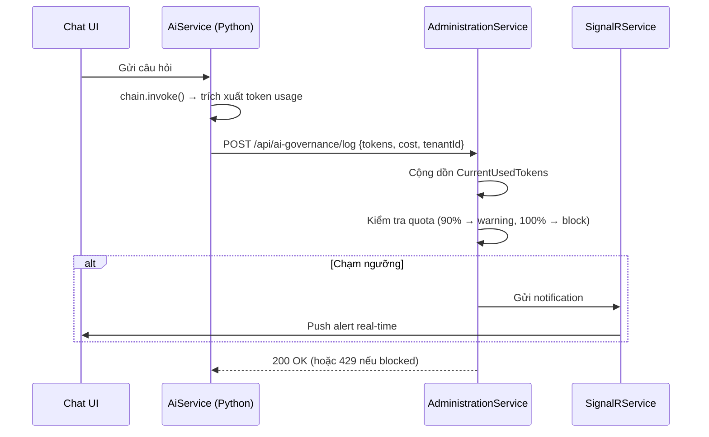

# [feature] AI Governance & Monitoring (Phase 6)

> **Notion:** https://www.notion.so/AI-Governance-Monitoring-Spec-32bf1e6a215c81dca2c3ebefb095b0f4
> **Stitch Screen ID:** `ad06b34dc2ba4226b212178ad326de1a` (Desktop Main), `1b3e2b93e5844e538a537263068e6d28` (Mobile Analytics)
> **Ngày tạo:** 2026-03-20
> **Cập nhật lần cuối:** 2026-03-25
> **Status:** in-progress
> **Module:** AdministrationService / AiService / Frontend

---

## 📋 Mô tả

Hệ thống theo dõi và quản trị sử dụng AI cho toàn hệ thống. Đảm bảo minh bạch chi phí, kiểm soát hạn mức token theo từng Tenant, cảnh báo tự động khi chạm ngưỡng và báo cáo đa cấp (Global Admin / Tenant Admin).

## 🎯 Mục tiêu & Actor

- **Actor:** Global Admin (toàn hệ thống), Tenant Admin (phạm vi Tenant)
- **Mục tiêu:** Giám sát và kiểm soát chi phí AI — ngăn vượt hạn mức, cảnh báo tự động, báo cáo chi tiết

## 🖼 UI Design

> Stitch Screen ID: `ad06b34dc2ba4226b212178ad326de1a` (Desktop 2560×3082px Main) | `5205862731874169b9ad587d6c6ef65d` (Desktop Extended) | `1b3e2b93e5844e538a537263068e6d28` (Mobile Analytics 828×2594px) | `515b55fcafc24773a92b3e8d0ab6d4f0` (Mobile Governance 780×2344px)

### Bố cục tổng thể
- **Sidebar (~220px):** Logo "The Neon Curator – AI Oversight" → Nav: Dashboard / AI Governance (active) / Model Settings / Audit Logs / Billing / Support / Sign Out
- **Main:** H1 "AI Analytics" + actions (EXPORT REPORT, NEW POLICY) → 4 Stat Cards → 2/3+1/3 layout (Area Chart + Security Card) → "Live Pulse" 2-col (Incidents + Quota Warnings) → Policy AI Suggestion → Model Quotas Table

### Danh sách Component
| Component | Mục đích | Server/Client |
|-----------|----------|---------------|
| `AiGovernancePage` | Dashboard chính, fetch usage data | Server |
| `TokenUsageChart` | Area chart xu hướng token theo ngày | Client |
| `QuotaConfigForm` | Form cấu hình hạn mức per-Tenant | Client |
| `ModelQuotasTable` | Bảng quota + progress bar per model | Server |
| `LivePulsePanel` | Real-time incidents + warnings | Client |

## 🔀 Flow

## 📐 Scope ảnh hưởng

- [x] Model / DB: `AiUsageLogs` (per-request log), `AiQuotas` (per-tenant quota config + state)
- [x] API endpoint: `POST /api/ai-governance/log`, `GET /api/ai-governance/usage-report`, `PUT /api/ai-governance/quota-config`
- [x] Permission: `AiGovernance.View` (Admin), `AiGovernance.Configure` (Host Admin)
- [x] Frontend: `AiGovernancePage`, Charts, `QuotaConfigForm`
- [x] Background job: `AiQuotaResetJob` (Hangfire, chạy ngày 1 hàng tháng)
- [x] SignalR: Push notification khi chạm 90% / 100% quota

## ✅ Checklist

### Backend
- [x] Entity `AiUsageLog` + `AiQuota` + Migration
- [x] `IAiGovernanceService` — `UpdateQuotaAsync`, `IsQuotaExceededAsync`
- [x] `AiGovernanceController` — 3 endpoints
- [x] `AiQuotaResetJob` — Hangfire monthly reset
- [x] Threshold alerting qua SignalRService

### AI Service (Python)
- [x] Trích xuất token usage từ LangChain result
- [x] Gửi log về Backend sau mỗi chat turn

### Frontend
- [x] `AiGovernancePage` — Dashboard với charts
- [x] `QuotaConfigForm` — Cấu hình hạn mức per-Tenant
- [x] Tích hợp thông báo hết hạn mức trên Chat UI

## ⚠️ Rủi ro / Lưu ý

- Interface `IAiGovernanceService` phải nhất quán tên method với implementation (đã fix bug 2026-03-22)
- `AiQuotaResetJob` cần idempotent — không double-reset nếu job chạy lại
- Hard Limit block phải trả 429 (không phải 500) để Frontend xử lý gracefully

## 📝 Ghi chú hoàn thành

Phase 1–5 (Backend + Frontend) đã hoàn thành. Phase 6 in-progress. Bug `AiGovernanceService build error` đã resolve 2026-03-22. UI đồng bộ Stitch → Notion ngày 2026-03-25 với 4 screens.

### Bug Log
| Bug ID | Mô tả | Status | Ngày fix |
|--------|-------|--------|----------|
| #001 | `ADMIN_AiQuotas` table missing (42P01) | Fixed | 2026-03-20 |
| #002 | `IAiGovernanceService` method mismatch | Fixed | 2026-03-22 |
