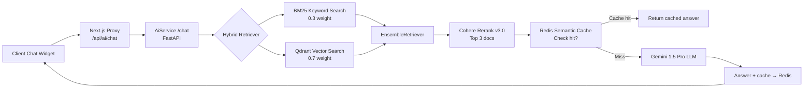

# [feature] AI Service Infrastructure (RAG Architecture)

> **Notion:** *(chưa có trang riêng — xem Business Notebook spec)*
> **Ngày tạo:** 2026-03-17
> **Cập nhật lần cuối:** 2026-03-25
> **Status:** done
> **Module:** AiService (Python/FastAPI) / Qdrant

---

## 📋 Mô tả

Hạ tầng AI phục vụ **Business AI Notebook**: RAG pipeline (Retrieval-Augmented Generation) với Hybrid Search (BM25 + Qdrant Vector), Cohere Rerank, Redis Semantic Cache và isolation đa tenant. Mọi dữ liệu được tag `tenant_id` → không bao giờ cross-tenant.

## 🎯 Mục tiêu & Actor

- **Actor:** End User (qua Frontend Chat Widget), AiService (internal)
- **Mục tiêu:** Trả lời câu hỏi nghiệp vụ ERP chính xác dựa hoàn toàn trên Knowledge Base nội bộ — không rò rỉ thông tin kỹ thuật

## 🔀 Flow

**Security Guardrails:** System Prompt chặn câu hỏi về DB schema, API, code backend, kiến trúc hệ thống.

## 📐 Scope ảnh hưởng

- [x] Model / DB: Qdrant collection (per-tenant chunks với `tenant_id` metadata), Redis (semantic cache)
- [x] API endpoint: `POST /chat`, `POST /ingest`, `POST /feedback`
- [x] Permission: `tenant_id` từ JWT → filter Qdrant metadata
- [x] Frontend: Next.js API Routes `/api/ai/chat` làm proxy (giữ GOOGLE_API_KEY server-side)
- [ ] Background job: N/A

## ✅ Checklist

### AiService (Python)
- [x] FastAPI boilerplate + Docker setup (port 8000)
- [x] Qdrant integration — collection per-system, filter by `tenant_id`
- [x] Ingestion: `.md` files → chunk (800/150) → embed → Qdrant
- [x] Hybrid Search: `EnsembleRetriever` (BM25 0.3 + Qdrant 0.7)
- [x] Cohere Rerank v3.0 — top 3 docs
- [x] Redis Semantic Cache
- [x] System Guardrail Prompt
- [x] `/feedback` endpoint (thumbs up/down)
- [x] Token usage extraction + gửi log về AdminService

### Frontend
- [x] `/api/ai/chat` proxy route
- [x] `/api/ai/ingest` admin trigger route

## ⚠️ Rủi ro / Lưu ý

- **Hallucination**: Cần System Prompt mạnh + "I don't know" fallback rõ ràng
- **Multi-tenant isolation**: Mọi ingest/query phải kèm `tenant_id` — không được default tenant hoặc skip filter
- **Ports:** AiService `8000:8000`, Qdrant `6333:6333` (HTTP) / `6334:6334` (gRPC)

## 📝 Ghi chú hoàn thành

Infrastructure hoàn chỉnh từ 2026-03-17. Tối ưu Hybrid Search + Rerank + Cache hoàn thành giai đoạn 5. Giai đoạn 6 (AI Governance) đang in-progress.

| Biến môi trường | Mục đích |
|-----------------|---------|
| `GOOGLE_API_KEY` | Gemini LLM + Embedding |
| `QDRANT_HOST` | Vector DB host |
| `QDRANT_COLLECTION_NAME` | Tên collection |
| `COHERE_API_KEY` | Reranking model |
| `REDIS_URL` | Semantic cache |
