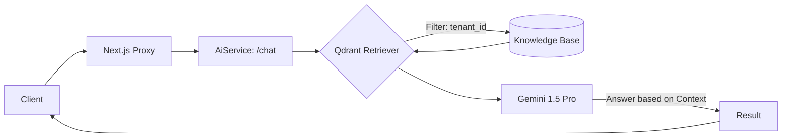

# Architecture: AI Service Infrastructure

## 1. Tổng quan
Dịch vụ AI phục vụ tính năng **Business AI Notebook**. 
Cung cấp giải pháp RAG (Retrieval-Augmented Generation) để trả lời các câu hỏi nghiệp vụ ERP.

## 2. Tech Stack Chi tiết
- **Frontend Proxy**: Next.js API Routes (Server Side handling API Key).
- **Core AI Service**: Python 3.11 (FastAPI).
- **Vector Database**: Qdrant (Lưu trữ và tìm kiếm vector).
- **LLM Engine**: Google Gemini 1.5 Pro.
- **Embedding Model**: Google Gemini Embeddings (`models/embedding-001`).

## 3. Quy tắc Bảo mật & Isolation (Multi-tenant)
- **Tenant Isolation**: 
  - Mọi dữ liệu (Chunks) khi đẩy vào Qdrant đều được gán nhãn `tenant_id` trong metadata.
  - Khi người dùng gửi câu hỏi, AI Service thực hiện lọc Metadata trùng khớp với `tenant_id` từ Token.
- **Security Guardrails**: 
  - System Prompt chặn toàn bộ các câu hỏi liên quan đến: Database schema, API endpoints, Code Backend (.NET/Python), và Kiến trúc hệ thống.
  - Từ chối lịch sự và hướng dẫn người dùng quay lại nội dung nghiệp vụ.

## 4. Sơ đồ Hoạt động (Data Flow)

### Sơ đồ ASCII (Tổng quan):
```text
+----------+      +----------------+      +------------------+      +-----------------+
|  Client  | <--> | Next.js Proxy  | <--> |  AiService       | <--> |  Gemini 1.5 Pro |
| (Widget) |      | (Auth & Proxy) |      |  (/chat endpoint)|      |  (LLM Engine)   |
+----------+      +----------------+      +--------+---------+      +-----------------+
                                                   |
                                                   | Query & Filter:
                                                   | { tenant_id: "..." }
                                                   v
                                          +------------------+
                                          |  Qdrant Vector DB|
                                          | (Knowledge Base) |
                                          +------------------+
```

### Sơ đồ Mermaid (Chi tiết):


## 5. Cấu hình Port & Kết nối
- **AiService**: `8000:8000`
- **Qdrant**: `6333:6333` (HTTP), `6334:6334` (gRPC)
- Biến môi trường quan trọng: `GOOGLE_API_KEY`, `QDRANT_HOST`, `QDRANT_COLLECTION_NAME`.

## 6. Lộ trình Triển khai
- [x] Giai đoạn 1: Triển khai Infrastructure (Docker, Python boilerplate).
- [x] Giai đoạn 2: Hoàn thiện logic RAG & Ingestion.
- [ ] Giai đoạn 3: Tích hợp vào Frontend ERP.
