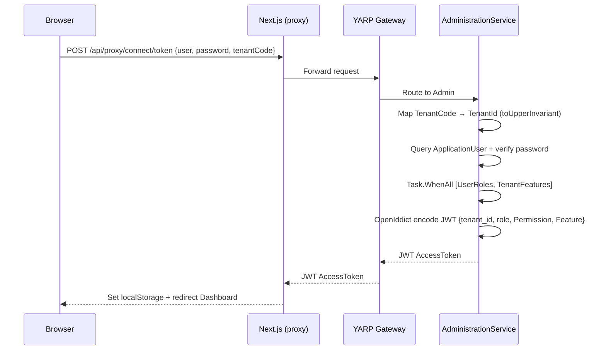

# [feature] Đăng nhập & Xác thực (OpenIddict OAuth2)

> **Notion:** *(chưa có mapping trong INDEX.md — cần bổ sung)*
> **Stitch Screen ID:** `85c018aa7c184097a9d4ef40ef880c05` (Mobile Login 780×1768px)
> **Ngày tạo:** 2026-03-10
> **Cập nhật lần cuối:** 2026-03-25
> **Status:** done
> **Module:** AdministrationService / Frontend

---

## 📋 Mô tả

Hệ thống xác thực sử dụng OAuth2 Password Flow với OpenIddict tạo JWT trực tiếp trên AdministrationService. Next.js đóng vai proxy trung gian và quản lý Token client-side qua `AuthWrapper` component + localStorage.

## 🎯 Mục tiêu & Actor

- **Actor:** Mọi User (đăng nhập lần đầu), AuthWrapper (guard mỗi route)
- **Mục tiêu:** Xác thực an toàn, phát JWT chứa claims đầy đủ (tenant, role, permission, feature), bảo vệ tất cả routes

## 🖼 UI Design

> Stitch Screen ID: `85c018aa7c184097a9d4ef40ef880c05` (Mobile 780×1768px)

### Bố cục tổng thể
- Full-screen dark gradient — Logo MintERP + tagline trên đầu
- Glassmorphism card giữa màn hình: Email field, Password field (toggle show/hide), Remember Me, nút LOGIN (gradient primary, full width), link "Forgot password?"

### Danh sách Component
| Component | Mục đích | Server/Client |
|-----------|----------|---------------|
| `LoginPage` | Trang đăng nhập | Client |
| `AuthWrapper` | Guard bảo vệ toàn bộ routes | Client |
| `TokenManager` | Quản lý localStorage + refresh | Client |

## 🔀 Flow

## 📐 Scope ảnh hưởng

- [x] Model / DB: `ApplicationUser`, `UserRole`, `TenantFeature` — Dynamic Connection String per Tenant
- [x] API endpoint: `POST /connect/token` (FormUrlEncoded), `POST /connect/logout`
- [x] Permission: JWT claims: `tenant_id`, `role`, `Permission`, `Feature`
- [x] Frontend: `LoginPage`, `AuthWrapper` (useRef guard), `TokenManager`
- [ ] Background job: N/A

## ✅ Checklist

### Backend
- [x] OpenIddict config với Password Flow
- [x] `TenantCode.ToUpperInvariant()` mapping
- [x] `Task.WhenAll` load UserRoles + TenantFeatures song song
- [x] Wildcard Admin — bypass Permission claims nặng, dùng role 'Admin' shortcut
- [x] Self-certificate bypass cho dev environment

### Frontend
- [x] `LoginPage` với Glassmorphism card
- [x] `AuthWrapper` guard dùng `useRef` (loại bỏ spinner flicker)
- [x] 401 → clear localStorage ngay, tránh redirect loop
- [x] Logout → clear cache trước khi call `/connect/logout`

## ⚠️ Rủi ro / Lưu ý

- Token payload size: Wildcard Admin không nhồi tất cả Permission claims vào JWT — code backend bypass theo role 'Admin'
- Isolated DB Tenant: `AdministrationService` phải switch Connection String đúng scope trước khi query

## 📝 Ghi chú hoàn thành

Module ổn định từ 2026-03-10. Stitch screen (Login Mobile) đã đồng bộ Notion ngày 2026-03-25.
Xem thêm: [Dynamic Permission Skill](../../skills/erp-dynamic-permission/SKILL.md)
