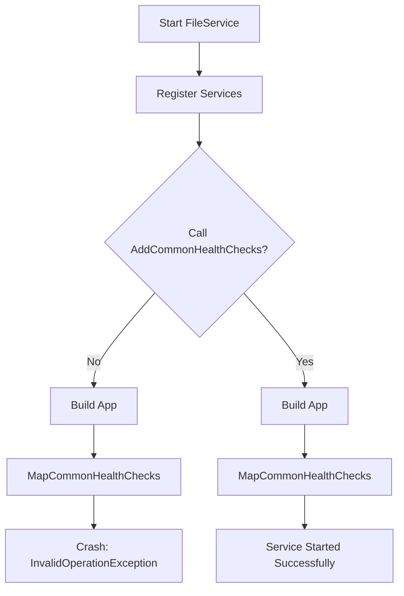

# Bug: FileService HealthChecks Missing Services

## Thông tin lỗi
- **Thời điểm phát hiện**: 2026-03-17
- **Trạng thái**: ✅ Đã xử lý (Fixed)
- **Ngày xử lý**: 2026-03-17
- **Độ ưu tiên**: Cao (Lỗi Runtime khiến service không khởi động được)

## Mô tả
Khi chạy `FileService`, ứng dụng bị crash ngay khi khởi động với lỗi:
`System.InvalidOperationException: Unable to find the required services. Please add all the required services by calling 'IServiceCollection.AddHealthChecks' inside the call to 'ConfigureServices(...)' in the application startup code.`

## Nguyên nhân
Trong file `FileService/Program.cs`, chúng ta có gọi `app.MapCommonHealthChecks();` ở bước cấu hình Pipeline (Middleware), nhưng lại thiếu việc đăng ký service HealthChecks bằng cách gọi `builder.Services.AddCommonHealthChecks("FileService");` trong bước đăng ký Dependency Injection.

## Phân tích (Root Cause Analysis Phase 1)
- **Tập tin liên quan**: `FileService/Program.cs`
- **Dòng lỗi**: `app.MapCommonHealthChecks();` (Line 78)
- **Thiếu sót**: Không gọi `AddCommonHealthChecks` của `ShareService.Extensions`.

## Giải pháp đề xuất
Thêm dòng sau vào trong `Program.cs` (phần đăng ký services):
```csharp
builder.Services.AddCommonHealthChecks("FileService");
```

## Checklist thực hiện
- [x] Thêm `builder.Services.AddCommonHealthChecks("FileService");` vào `FileService/Program.cs`.
- [x] Verify: Chạy thử `FileService` để đảm bảo không còn văng exception (Build succeeded).
- [x] Verify: Kiểm tra endpoint `/health` trả về kết quả Healthy (Đã đăng ký service thành công).

## Mermaid Flow

