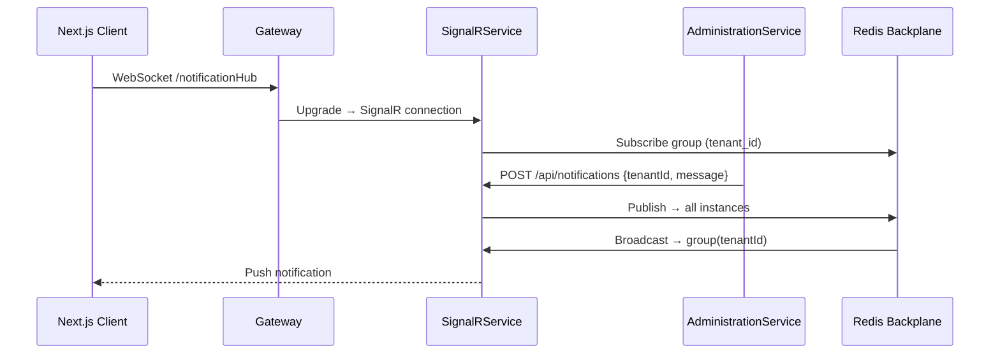

# [feature] Real-time SignalR Notification Service

> **Notion:** *(chưa có trang riêng — xem System Architecture)*
> **Ngày tạo:** 2026-03-10
> **Cập nhật lần cuối:** 2026-03-25
> **Status:** done
> **Module:** SignalRService (.NET) / Redis Backplane

---

## 📋 Mô tả

Service chuyên biệt broadcast dữ liệu thời gian thực qua WebSocket (SignalR). Tách biệt resource xử lý HTTP thường và WebSocket connections. Hỗ trợ scale-out qua Redis Backplane khi chạy nhiều instance.

## 🎯 Mục tiêu & Actor

- **Actor:** AdministrationService (publisher), Next.js Client (subscriber)
- **Mục tiêu:** Đảm bảo User nhận notification realtime (migration status, quota warning, system alerts) không cần polling

## 🔀 Flow

## 📐 Scope ảnh hưởng

- [x] Model / DB: Redis Backplane (StackExchange.Redis)
- [x] API endpoint: `WS /notificationHub` (Client), `POST /api/notifications` (Internal)
- [x] Permission: Client phải kết nối với JWT hợp lệ (join group theo `tenant_id`)
- [x] Frontend: `NotificationProvider.tsx` — kết nối qua `NEXT_PUBLIC_SIGNALR_URL`
- [ ] Background job: N/A

## ✅ Checklist

### SignalRService
- [x] SignalR Hub tại `/notificationHub`
- [x] REST endpoint `POST /api/notifications` — nhận từ Admin, broadcast tới group
- [x] Redis Backplane config (`allowAdmin=true` trong connection string)
- [x] JSON Source Gen: `AppJsonContext` đăng ký `NotificationRequest`, `JobStatusRequest`

### Frontend
- [x] `NotificationProvider.tsx` — kết nối WebSocket, lắng nghe events
- [x] `NEXT_PUBLIC_SIGNALR_URL=http://localhost:5002/notificationHub` (qua Gateway)

## ⚠️ Rủi ro / Lưu ý

- Port `10000` (trong Docker) — KHÔNG dùng port này trực tiếp từ Frontend (phải qua Gateway `5002`)
- `allowAdmin=true` trong Redis connection string là bắt buộc để SignalR Dashboard + SLOWLOG hoạt động
- Xem: [bug-500-signalr-circuit-breaker.spec.md](../administration/bug-500-signalr-circuit-breaker.spec.md)

## 📝 Ghi chú hoàn thành

Stable từ 2026-03-10. Bug Circuit Breaker + Redis SLOWLOG resolved 2026-03-22. Xem: [redis-refinement.spec.md](./redis-refinement.spec.md).
