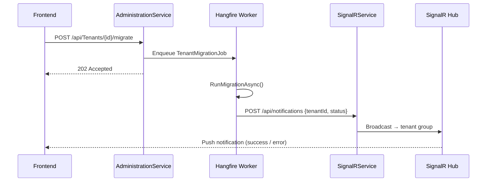

# [fix_bug] Tenant Migration không trả Notification

> **Notion:** *(resolved — không tạo Notion riêng)*
> **Ngày tạo:** 2026-03-15
> **Cập nhật lần cuối:** 2026-03-25
> **Status:** done
> **Module:** AdministrationService / SignalRService

---

## 📋 Mô tả

Khi System Admin nhấn "Migrate" cho một Tenant, background job chạy thành công (Hangfire báo Success) nhưng không có notification nào xuất hiện trên UI. Root cause: `admin-service` trong Docker dùng `localhost` mặc định thay vì `http://signalr:10000` để tìm SignalRService.

## 🎯 Mục tiêu & Actor

- **Actor:** System Admin (trigger migration), System (Hangfire job)
- **Mục tiêu:** Sau khi migration hoàn thành, UI nhận notification realtime (thành công hoặc thất bại)

## 🔀 Flow (Correct)

## 📐 Scope ảnh hưởng

- [x] Model / DB: N/A
- [x] API endpoint: N/A
- [x] Permission: JWT claim `tenant_id` phải có để join đúng SignalR group
- [x] Frontend: `NotificationProvider.tsx` — verify URL `NEXT_PUBLIC_SIGNALR_URL`
- [x] Background job: `TenantMigrationJob` — gọi `ISignalRNotificationService` sau khi migrate
- [x] SignalR: Port phải là `10000` (nhất quán Dockerfile / docker-compose / AdminService config)

## ✅ Checklist

### Backend
- [x] `docker-compose.yml` — thêm `SignalRService__BaseUrl=http://signalr:10000` cho `admin-service`
- [x] `Program.cs` — cập nhật fallback URL từ `localhost:5003` → `http://signalr:10000`
- [x] Rebuild + restart: `docker-compose up -d --build admin-service`

### Verify
- [x] Thực hiện migration thử → nhận notification trên UI
- [x] Kiểm tra log container xác nhận kết nối thành công

## ⚠️ Rủi ro / Lưu ý

- `SignalRNotificationService` swallow exception (chỉ log) → Job vẫn báo Success dù notify thất bại → Cần monitor log riêng
- Frontend `NEXT_PUBLIC_SIGNALR_URL=http://localhost:5002/notificationHub` (Port 5002 = Gateway) — Gateway đã proxy đúng sang SignalR

## 📝 Ghi chú hoàn thành

Fixed 2026-03-15. Lỗi gốc: hardcode `localhost` trong Docker environment. Fix: env var `SignalRService__BaseUrl` trong compose.
